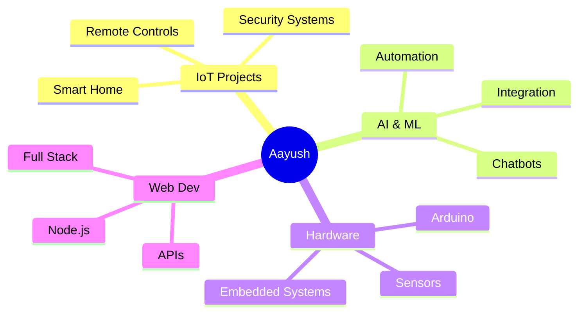

<div align="center">
  
</div>

<div align="center">
  
</div>

<div align="center">
  
  [](https://www.linkedin.com/in/aayushbhatt06)
  [](https://github.com/Aayushbhatt06)
  [](https://github.com/Aayushbhatt06)
  
</div>

<br>

## 🚀 About Me


```javascript
const aayush = {
    pronouns: "he" | "him",
    location: "India 🇮🇳",
    currentFocus: ["IoT", "AI Integration", "Embedded Systems"],
    interests: ["Hardware Projects", "Automation", "Smart Systems"],
    funFact: "I turn caffeine into code ☕➡️💻",
    askMeAbout: ["Arduino", "AI Chatbots", "IoT Solutions"],
    technologies: {
        languages: ["JavaScript", "C++", "Python"],
        hardware: ["Arduino", "Sensors", "Bluetooth Modules"],
        tools: ["VS Code", "Git", "Node.js"],
        currentlyLearning: ["Machine Learning", "Cloud IoT"]
    }
};
```

<br clear="right"/>

## 🛠️ Tech Stack & Tools

<div align="center">

### Languages


### Technologies & Frameworks


### AI & APIs


</div>

<br>

## 📊 GitHub Statistics

<div align="center">
  
  
</div>

<div align="center">
  
</div>

<br>

## 🔥 Featured Projects

<div align="center">

<a href="https://github.com/Aayushbhatt06/Gemini-Chat-Bot">
  
</a>

<a href="https://github.com/Aayushbhatt06/SkillMate-Lets_Trade_Talent">
  
</a>

</div>

<br>

### 🤖 Gemini Chat Bot
> AI-powered conversational chatbot using Google's Gemini API
- 🧠 Natural language processing
- ⚡ Real-time responses
- 🎯 Intelligent conversation flow

### 🎓 SkillMate - Let's Trade Talent
> Platform connecting people to exchange skills and knowledge
- 🤝 Skill exchange marketplace
- 👥 Community-driven learning
- 🌐 Connect with like-minded individuals

<br>

## 📈 Contribution Activity

<div align="center">
  
</div>

<br>

## 🏆 GitHub Trophies

<div align="center">
  
</div>

<br>

## 💡 What Drives Me

<div align="center">



</div>

<br>

## 🎯 Current Focus

<div align="center">

| 🔭 Working On | 🌱 Learning | 👯 Looking to Collaborate |
|:---:|:---:|:---:|
| IoT Automation | ML Integration | Open Source Projects |
| AI Chatbots | Cloud IoT | Hardware Solutions |
| Embedded Systems | Advanced Arduino | Innovation Labs |

</div>

<br>

## 🐍 Contribution Snake

<div align="center">
  
</div>

<br>

## 💬 Random Dev Quote

<div align="center">
  
</div>

<br>

## 🤝 Let's Connect & Collaborate!

<div align="center">
  
I'm always excited to work on innovative projects involving:
  
🤖 **IoT & Smart Systems** | 🔐 **Security Solutions** | 🤝 **AI Integration** | 💡 **Hardware Innovation**
  
Feel free to reach out for collaborations or just a tech chat!

<br>

[](https://www.linkedin.com/in/aayushbhatt06)
[](https://github.com/Aayushbhatt06)
[](mailto:your.email@example.com)

</div>

<br>

<div align="center">
  
</div>

<div align="center">
  
### Show some ❤️ by starring some of the repositories!
  


</div>
